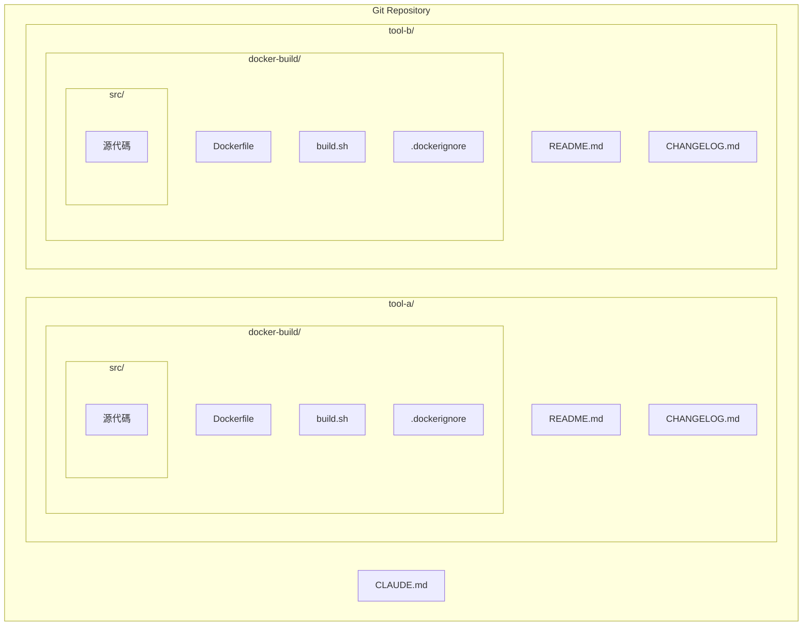
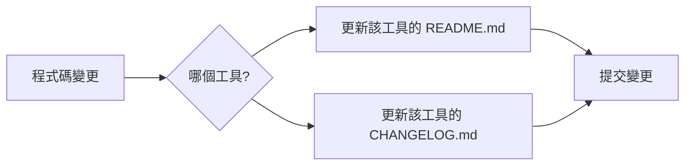
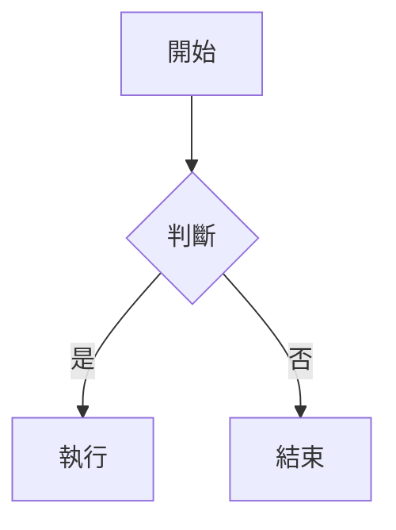
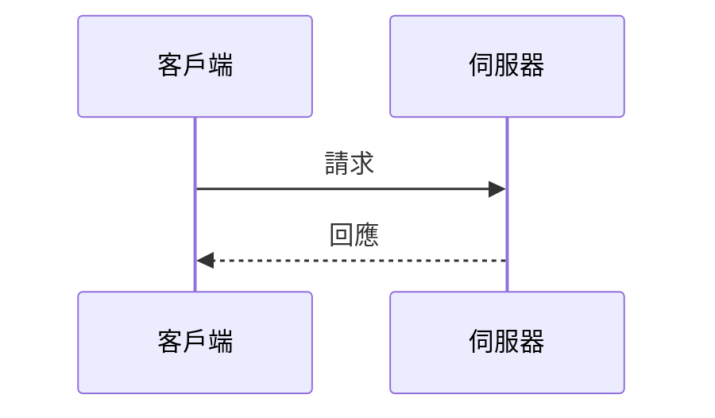
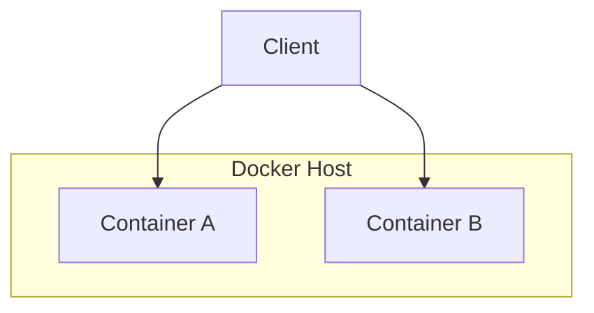

# CLAUDE.md - Claude Code 編碼規範

> 這是 Claude Code 在此專案中必須遵循的規範文件。在撰寫任何程式碼之前，請先閱讀此文件。

## 📁 專案結構規範

### 整體目錄組織

本專案為多工具型 Git 專案，每個工具獨立一個目錄，擁有自己的文件與 Docker 建置環境。

```
<project-name>/                     # Git 專案根目錄
├── CLAUDE.md                       # Claude Code 規範文件（本文件）
│
├── <tool-a>/                       # 工具 A
│   ├── README.md                   # 該工具的說明文件
│   ├── CHANGELOG.md                # 該工具的變更日誌
│   └── docker-build/               # Docker 建置目錄
│       ├── Dockerfile              # Docker 映像定義
│       ├── build.sh                # 建置腳本
│       ├── .dockerignore           # Docker 忽略檔案
│       └── src/                    # 源代碼目錄（必須）
│           └── ...
│
├── <tool-b>/                       # 工具 B
│   ├── README.md                   # 該工具的說明文件
│   ├── CHANGELOG.md                # 該工具的變更日誌
│   └── docker-build/               # Docker 建置目錄
│       ├── Dockerfile              # Docker 映像定義
│       ├── build.sh                # 建置腳本
│       ├── .dockerignore           # Docker 忽略檔案
│       └── src/                    # 源代碼目錄（必須）
│           └── ...
│
└── <tool-n>/                       # 其他工具...
    ├── README.md
    ├── CHANGELOG.md
    └── docker-build/
        ├── Dockerfile
        ├── build.sh
        ├── .dockerignore
        └── src/                    # 源代碼目錄（必須）
            └── ...
```

### 核心規則

1. **每個工具必須有獨立的目錄**
2. **每個工具目錄必須包含**：
   - `README.md` - 該工具的說明文件
   - `CHANGELOG.md` - 該工具的變更日誌
   - `docker-build/` - Docker 建置目錄
3. **Docker 建置目錄 `docker-build/` 必須包含**：
   - `Dockerfile` - Docker 映像定義
   - `build.sh` - 建置腳本（可執行）
   - `.dockerignore` - Docker 忽略檔案
   - `src/` - **源代碼目錄（所有程式碼必須放在此）**
4. **禁止在工具根目錄或 `docker-build/` 根目錄直接放置源代碼**
5. **禁止在工具根目錄直接撰寫 Dockerfile**

### 架構圖



---

## 🐳 Docker 建置規範

### 映像建置要求

- **目標平台**: 所有 Docker 映像必須能在 Linux 機器上運行
- **多平台支援**: 使用 `--platform linux/amd64` 確保跨平台相容性
- **基礎映像**: 優先使用官方映像，並指定具體版本標籤

### Dockerfile 規範

```dockerfile
# 必須指定平台
FROM --platform=linux/amd64 <base-image>:<version>

# 必須包含 LABEL
LABEL maintainer="<maintainer>"
LABEL version="<version>"
LABEL description="<description>"

# 支援版本號建置參數
ARG APP_VERSION=1
ENV APP_VERSION=${APP_VERSION}

# 使用多階段建置減少映像大小（如適用）
```

### build.sh 腳本規範

每個工具的 `docker-build/` 目錄必須包含 `build.sh` 腳本，使用以下模板：

```bash
#!/bin/bash
# Build and push <image-name> Docker image
#
# Usage:
#   ./build.sh        # 使用預設 tag "1"
#   ./build.sh 2      # 指定 tag "2"
#   ./build.sh 1.0.0  # 指定 tag "1.0.0"

set -e

# ============================================
# 配置區 - 根據專案修改以下變數
# ============================================
REGISTRY="<registry-url>"
IMAGE_NAME="<image-name>"
# ============================================

TAG="${1:-1}"
FULL_IMAGE="${REGISTRY}/${IMAGE_NAME}:${TAG}"

echo "Building ${FULL_IMAGE}..."

docker build \
    --provenance=false \
    --platform linux/amd64 \
    --build-arg APP_VERSION="${TAG}" \
    -t "${FULL_IMAGE}" \
    .

echo ""
echo "Build complete!"
echo ""

read -p "Push to registry? (y/N): " PUSH_CONFIRM

if [[ "${PUSH_CONFIRM}" =~ ^[Yy]$ ]]; then
    echo "Pushing ${FULL_IMAGE}..."
    docker push "${FULL_IMAGE}"
    echo "Push complete!"
else
    echo "Skipped push."
fi

echo ""
echo "Image: ${FULL_IMAGE}"
```

**build.sh 必要特性：**

| 特性 | 說明 |
|------|------|
| 預設標籤 | 預設為 `1`（從 1 開始遞增），可透過參數自訂 |
| 錯誤處理 | 使用 `set -e` 確保錯誤時停止 |
| 平台指定 | `--platform linux/amd64` |
| 版本傳遞 | `--build-arg APP_VERSION` 傳遞版本號 |
| Provenance | `--provenance=false` 避免產生額外 metadata |
| 推送確認 | 建置完成後詢問是否推送至 Registry |
| 可執行權限 | 需設定 `chmod +x build.sh` |

**使用者需修改的變數：**
- `REGISTRY` - 容器 Registry 位址
- `IMAGE_NAME` - 映像名稱

---

## 📝 文件規範

### 每個工具的 README.md 要求

每個工具目錄下的 `README.md` 必須包含以下章節：

```markdown
# <工具名稱>

## 簡介
簡短描述此工具的用途

## 架構圖
（使用 Mermaid 語法）

## 快速開始

### 前置需求
- Docker 環境
- ...

### 建置映像
cd docker-build
./build.sh [tag]

### 執行方式
docker run ...

## 環境變數
| 變數名稱 | 說明 | 預設值 |
|---------|------|--------|
| ... | ... | ... |

## 使用範例
...
```

### 每個工具的 CHANGELOG.md 要求

遵循 [Keep a Changelog](https://keepachangelog.com/) 格式：

```markdown
# Changelog

All notable changes to this project will be documented in this file.

## [Unreleased]

## [x.x.x] - YYYY-MM-DD
### Added
- 新增功能描述

### Changed
- 變更內容描述

### Fixed
- 修復內容描述

### Removed
- 移除內容描述
```

### 文件同步規則

> ⚠️ **重要**: 對某個工具的任何程式碼變更都必須同步更新該工具目錄下的文件：
> 1. `<tool>/README.md` - 更新相關說明
> 2. `<tool>/CHANGELOG.md` - 記錄變更內容



---

## 📊 架構圖規範

**所有 Markdown 文件中的架構圖一律使用 Mermaid 語法**

### 支援的圖表類型

1. **流程圖 (Flowchart)**


2. **序列圖 (Sequence Diagram)**


3. **架構圖 (Graph/Subgraph)**


### 禁止事項

- ❌ 不使用 ASCII 藝術圖
- ❌ 不使用外部圖片連結作為架構圖
- ❌ 不使用 PlantUML（除非專案已有既存使用）

---

## 🔧 程式碼風格

### Shell 腳本

- 使用 `#!/bin/bash` 作為 shebang
- 使用 `set -e` 確保錯誤時停止執行
- 變數使用大寫並加上引號：`"${VARIABLE}"`
- 註解使用中文或英文，保持一致性

### Dockerfile

- 每個指令獨立一行
- 相關指令使用 `&&` 合併以減少層數
- 清理暫存檔案以減少映像大小
- 使用 `.dockerignore` 排除不必要檔案
- 使用 `ARG` 接收建置參數

---

## 🆕 新增工具檢查清單

新增一個工具時，必須完成以下事項：

- [ ] 在專案根目錄建立工具目錄（例如：`my-new-tool/`）
- [ ] 建立 `my-new-tool/README.md`
- [ ] 建立 `my-new-tool/CHANGELOG.md`
- [ ] 建立 `my-new-tool/docker-build/` 目錄
- [ ] 建立 `my-new-tool/docker-build/Dockerfile`
- [ ] 建立 `my-new-tool/docker-build/build.sh`（並設為可執行）
- [ ] 修改 `build.sh` 中的 `REGISTRY` 和 `IMAGE_NAME`
- [ ] 建立 `my-new-tool/docker-build/.dockerignore`
- [ ] 建立 `my-new-tool/docker-build/src/` 目錄
- [ ] 將所有源代碼放入 `my-new-tool/docker-build/src/`

---

## ✅ 程式碼變更檢查清單

在提交任何變更前，確認以下事項：

- [ ] 程式碼放在正確的工具目錄下
- [ ] **源代碼放在該工具的 `docker-build/src/` 子目錄**
- [ ] Docker 映像指定了 `linux/amd64` 平台
- [ ] `build.sh` 存在且可執行
- [ ] `build.sh` 中的 `REGISTRY` 和 `IMAGE_NAME` 已正確設定
- [ ] 該工具的 `README.md` 已更新
- [ ] 該工具的 `CHANGELOG.md` 已記錄變更
- [ ] 架構圖使用 Mermaid 語法
- [ ] 所有腳本已測試可運行

---

## 📌 快速參考

| 項目 | 規範 |
|------|------|
| 專案結構 | 多工具型，每個工具獨立目錄 |
| Docker 建置目錄 | `<tool>/docker-build/` |
| **源代碼位置** | **`<tool>/docker-build/src/`** |
| 目標平台 | `linux/amd64` |
| 建置腳本 | `<tool>/docker-build/build.sh`（必須存在） |
| 架構圖格式 | Mermaid |
| 必要文件（每個工具） | README.md, CHANGELOG.md |

---

## 📂 範例：新增工具的完整結構

假設要新增一個名為 `my-tool` 的工具：

```
<project-name>/
└── my-tool/
    ├── README.md
    ├── CHANGELOG.md
    └── docker-build/
        ├── Dockerfile
        ├── build.sh
        ├── .dockerignore
        └── src/                # 所有源代碼必須放在這裡
            ├── main.py         # 範例：主程式
            ├── config.py       # 範例：配置檔
            └── utils/          # 範例：工具模組
                └── ...
```

> ⚠️ **重要**: 源代碼必須放在 `docker-build/src/` 目錄下，禁止直接放在 `docker-build/` 或工具根目錄。

---

*最後更新: 2025-01-19*