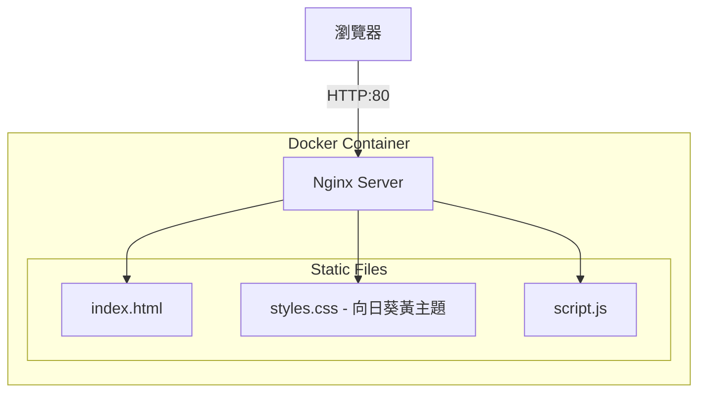

# 劉宇寧粉絲網站 - 大黃ㄚ頭 (LYN Fan Site)

## 簡介

這是一個致敬中國歌手、演員劉宇寧的粉絲網站，以他的應援色「向日葵黃」為主題色，展示他的個人資料、戲劇作品和音樂作品。

- **粉絲名**：大黃ㄚ頭 🌻
- **應援色**：向日葵黃 (#FFC300)

## 架構圖



## 快速開始

### 前置需求

- Docker 環境

### 建置映像

```bash
cd docker-build
./build.sh [tag]
```

### 執行方式

```bash
# 本機執行
docker run -d -p 8080:80 --name lyn-fansite yuchiao/lyn:1

# 訪問網站
open http://localhost:8080
```

## 環境變數

| 變數名稱 | 說明 | 預設值 |
|---------|------|--------|
| APP_VERSION | 應用程式版本 | 1 |

## 功能特色

- 🌻 向日葵黃主題配色
- 響應式設計，支援桌面與行動裝置
- 個人資料展示
- 戲劇作品展示（折腰、書卷一夢、紫川、一念關山等）
- 音樂作品展示（專輯、EP、影視OST）
- 獎項成就展示
- 互動動畫效果

## 劉宇寧簡介

劉宇寧（1990年1月8日－），中國內地流行樂男歌手、影視演員，摩登兄弟樂隊主唱。

### 代表作品

**戲劇**：
- 《折腰》(2025) - 飾演 魏劭
- 《書卷一夢》(2025)
- 《紫川》系列 - 飾演 帝林
- 《一念關山》(2023) - 飾演 寧遠舟
- 《長歌行》(2021) - 飾演 皓都

**音樂**：
- 專輯《十》(2019) - 東方風雲榜傳媒推薦專輯獎
- EP《如約》《Listen·Ning》
- 多首熱門影視OST：《天問》《琉璃》《無華》等
