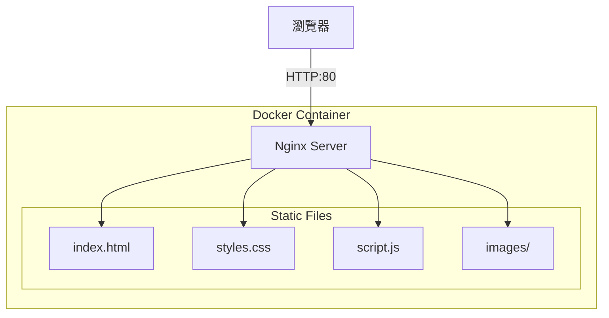

# 張凌赫粉絲網站 (ZLH Fan Site)

## 簡介

這是一個致敬中國演員張凌赫的粉絲網站，展示他的個人資料、戲劇作品和綜藝節目參與。

## 架構圖



## 快速開始

### 前置需求

- Docker 環境

### 建置映像

```bash
cd docker-build
./build.sh [tag]
```

### 執行方式

```bash
# 本機執行
docker run -d -p 8080:80 --name zlh-fansite yuchiao/zlh:1

# 訪問網站
open http://localhost:8080
```

## 環境變數

| 變數名稱 | 說明 | 預設值 |
|---------|------|--------|
| APP_VERSION | 應用程式版本 | 1 |

## 功能特色

- 響應式設計，支援桌面與行動裝置
- 戲劇作品展示（蒼蘭訣、寧安如夢、雲之羽等）
- 綜藝節目資訊
- 圖片輪播效果

## 公網域名

- `zlh.fancenter.online` - 透過 Cloudflare Tunnel 提供公網訪問
